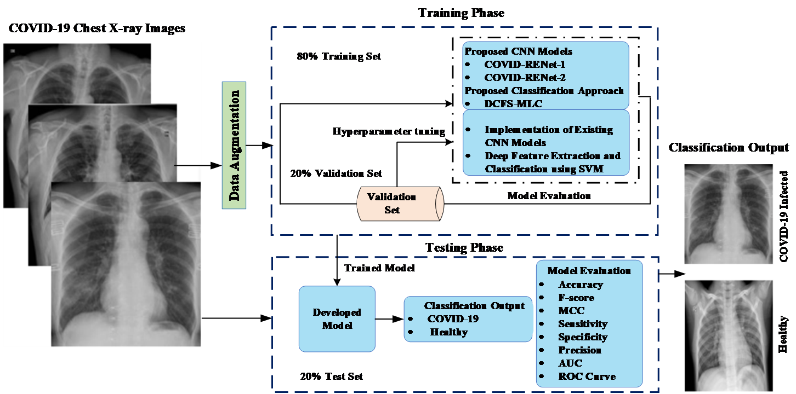
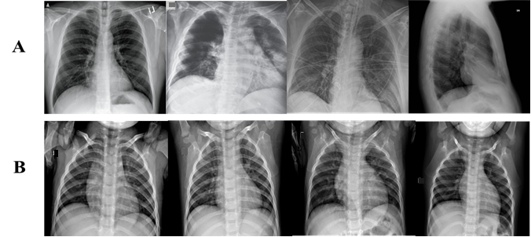
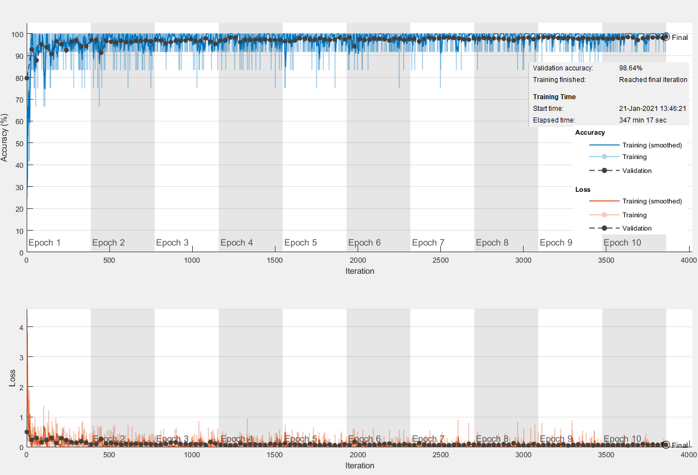

# Coronavirus Disease Analysis using Chest X-Ray Images and a Novel Deep Convolutional Neural Network

COVID-19 is a new, highly transmissible respiratory infection that has vastly affected human lives and greatly burdens the health care system. Therefore, it is indispensable to develop a fast and accurate diagnostic system for timely identification of COVID-19 infected patients and spread control. In this work, we proposed a new X-ray based COVID-19 classification framework consisting of (i) end-to-end classification module and (ii) deep concatenated feature space based ML classification module. In this regard, two new custom CNN architectures: COVID-RENet-1 and COVID-RENet-2 are developed for COVID-19 specific pneumonia analysis by systematically employing region and edge base operations along with convolution operations. The synergistic use of region and edge based operations explore the region homogeneity and textural variations, thus helps in capturing the pneumonia specific pattern. In the first module, COVID-RENets are used for end-to-end classification. In the second module, the discrimination power is enhanced by providing the features of the COVID-RENets to SVM for classification. The performance of the proposed classification framework is evaluated by comparing it against the state-of-the-art CNNs using radiologist’s authenticated chest X-Ray dataset. The proposed classification framework shows good generalization (accuracy: 98.53%, F-score: 0.98, MCC: 0.97) with considerably high sensitivity (0.99) and precision (0.98).

In this repository, we provide the MATLAB GUI and Testing Code for the Coronavirus Disease Analysis using Chest X-ray Images for the research community to use our research work.

## Overview of the workflow for the proposed COVID-19 Classification Framework

In this work, a new classification framework is developed based on deep learning and classical ML techniques for automatic discrimination of COVID-19 infected patients from healthy individuals based on chest X-ray images. The proposed classification framework is constituted of two modules: (i) Proposed COVID-RENet based end-to-end Classification, and (ii) Deep Concatenated Feature-space based ML classification. In the experimental setup, initially, training samples were augmented to improve the generalization. These augmented samples were used to train the two proposed modules. The overall classification setup of the proposed COVID-19 is shown in Fig. 1.



## Models Architectures

### Architectural details of the proposed COVID-RENet-1


### Architectural details of the proposed COVID-RENet-2


### Proposed deep concatenated feature space (DCFS-MLC)-based COVID-19 classification system

-based COVID-19 classification system")

**Trained Model is available at [COVID-RENet-1](https://drive.google.com/file/d/1IY8Di0Jqlmb7pjw6OmKdmc2QasnLQ3sA/view?usp=sharing) and [COVID-RENet-2](https://drive.google.com/file/d/1ctjUFQLtNgMcKbQCYdPaPEsWXiBqhujM/view?usp=sharing) links.**

## Dataset

We built a new dataset consisting of X-ray images of COVID-19 pneumonia and healthy individuals in this work. X-ray images were collected from Open Source GitHub repository and Kaggle repository called “pneumonia”

**Dataset will be available on request, contact at <hengrshkhan822@gmail.com>**

### Dataset Samples

Panel (A) and (B) show COVID-19 infected and healthy images, respectively.



## Training plot of Proposed COVID-RENet

### Training Plot of the Proposed COVID-RENet-1



### Training Plot of the Proposed COVID-RENet-2


## Results

Performance metrics for the state-of-the-art CNN models that are trained from scratch and TL-based fine-tuned pre-trained on the augmented dataset.


Performance metrics for the deep feature extraction from custom layers of state-of-the-art training from scratch and TL-based fine-tuned pre-trained CNN on the augmented dataset.


## Requirements

1. Matlab 2019b.
2. Deep Learning library.
3. NVIDIA GeForce GTX Titan X Computer.

## Setup

1. Clone this repo.

```git bash
git clone https://github.com/PRLAB21/Coronavirus-Disease-Analysis-using-Chest-X-Ray-Images.git
```

2. Download model and place it in following structure.

```text
Coronavirus-Disease-Analysis-using-Chest-X-Ray-Images
|__ models
   |__ net_RENet_VGG_Modified1.mat
   |__ net_RENet_VGG_Modified2.mat
```

3. Testing images are downloaded along with this repo and are present inside "test-dataset" directory.

4. Run testing code using below mentioned methods.

## Inference Code

1. Open MATLAB.
2. Change MATLAB Working Directory to this repository's folder from top panel.
3. Now add each folder to MATLAB path from Current Folder panel by right clicking on each folder and selecting Add to Path > Selected Folder and Subfolders.
4. Run any of the two test model using following files.

-   **test_code_RENet_VGG_Modifier1.m**: Use this file for testing the model "net_RENet_VGG_Modified1".

-   **test_code_RENet_VGG_Modifier2.m**: Use this file for testing the model "net_RENet_VGG_Modified2".

<!-- 4. Now you can run either test models individually or run MATLAB GUI App as described below. -->

<!-- ### Directory: classification-test-code

-   **test_code_RENet_VGG_Modifier1.m**: Use this file for testing the model "net_RENet_VGG_Modified1" on folder of images at once.

### Directory: MATLAB-GUI-app

-   Inside this directory there is **gui_classification.mlapp** file. In order to use MATLAB-GUI-app type following at command window.

```MATLAB
>> gui_classification
```

Now the GUI interface will open after some time, then it will allow use to load image, and classify it as COVID-19 or Non-COVID-19. -->

## Co-Author

Prof. Asifullah Khan,

Department of Computer and Information Sciences (DCIS),

Pakistan Institute of Engineering and Applied Sciences (PIEAS).

Email: asif@pieas.edu.pk

faculty.pieas.edu.pk/asifullah/

## How to cite / More information

Khan, Saddam Hussain, Anabia Sohail, Muhammad Mohsin Zafar, and Asifullah Khan. "Coronavirus Disease Analysis using Chest X-ray Images and a Novel Deep Convolutional Neural Network." (2020), 10.13140/Rg. 2.2. 35868.64646 April (2020): 1-31.
